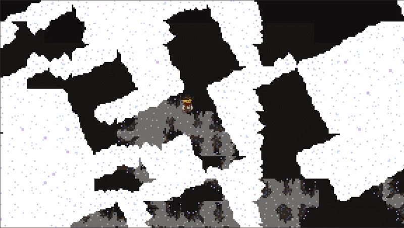

# SpaceCowboyN-2-Deep

## Background
In my game you play as a cozy space cowboy stranded in a cave trying to escape and get to the Capybara. 
It was meant to have an avalanche effect (thats why ur trapped) and then youd be able to escape the avalanche by breaking snow or something.

## Why is the gameplay horrendous
This game was made for a game jam during horizons. This would be the first game I had ever completed. 
I ran out of time during the game jam so and haven't really had time since so that is why it is in the state it is in.
I learnt that game dev takes quite a bit of time and that during a game jam it's a very good to have a working prototype as often as possible.
So if I were to do it again I would spend as little time on art as possible and focused on mechanics.
 

## How to play my game 

My game can be played on itch

https://l0ading-studi0s.itch.io/space-cowboy-n-2-deep

## Contribution
Other people can contribute by letting me know what they'd like to see or ways I could implement my ideas better.

## AI
I did not use AI at all to create the game or the assets 